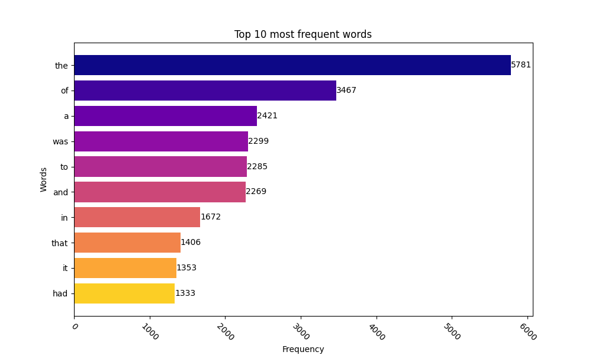

# SUMMARY

## Task. Word frequency

A Python script that loads text from a given URL, analyzes the frequency of word usage in the text using the MapReduce paradigm, and visualizes the top words with the highest frequency of usage in the text.

*PS: The book used for the assignment was Nineteen Eighty-Four (1984) is written by George Orwell*

